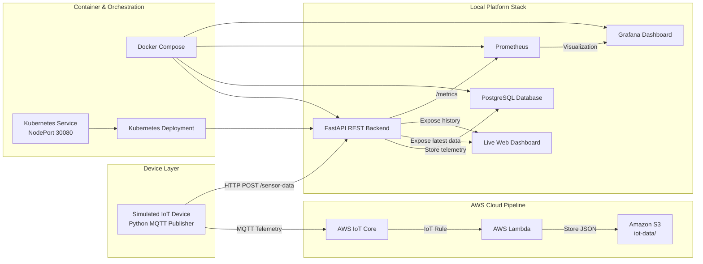
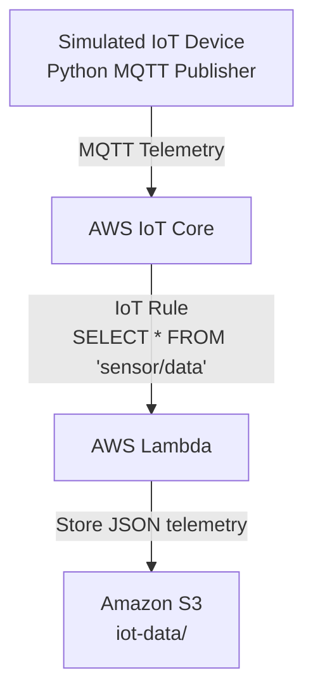
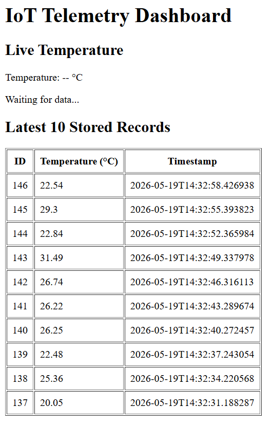
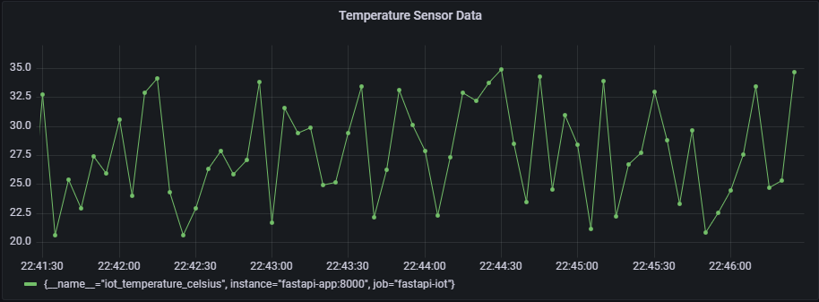
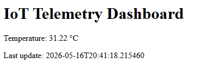
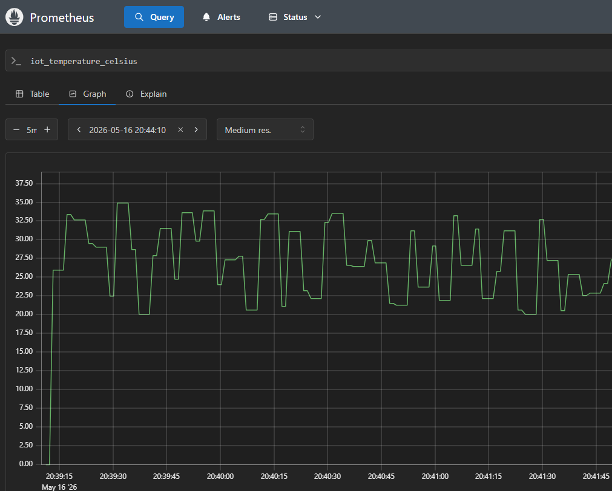
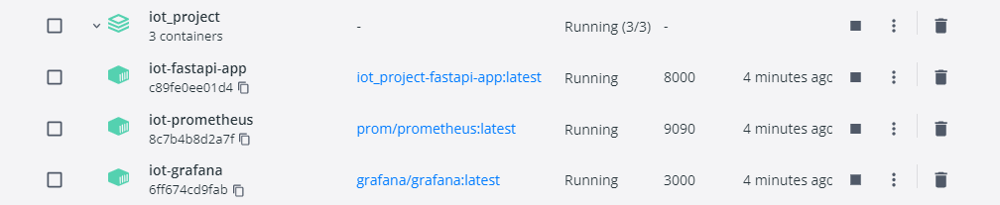
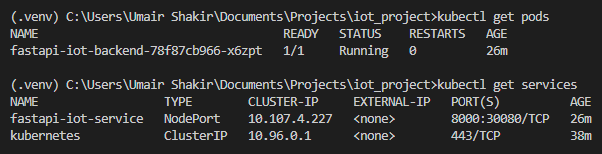

# IoT Cloud Platform

A cloud-native IoT telemetry, monitoring, and observability platform built using Python, AWS IoT Core, FastAPI, PostgreSQL, Docker, Kubernetes, Prometheus, and Grafana.

The project demonstrates an end-to-end telemetry pipeline combining cloud-native backend development, real-time monitoring, containerized deployment workflows, serverless AWS services, and persistent telemetry storage.

---

## Project Overview

The platform simulates IoT sensor telemetry data and publishes it through MQTT to AWS IoT Core. The telemetry is processed through multiple backend and cloud-native workflows:

- AWS IoT Core → Lambda → Amazon S3 serverless telemetry pipeline
- FastAPI REST backend for telemetry ingestion and API exposure
- PostgreSQL database persistence for historical telemetry storage
- Prometheus metrics scraping and Grafana observability dashboards
- Docker Compose multi-service orchestration
- Kubernetes-based local container orchestration and deployment

The system supports both real-time telemetry visualization and persistent historical telemetry analysis through REST APIs and monitoring dashboards.

---


## System Architecture



## AWS-Native Serverless Pipeline

The project also includes an AWS-native telemetry flow using AWS IoT Core, IoT Rules, Lambda, and Amazon S3.

### AWS Serverless Architecture



### Components

- **AWS IoT Core** receives MQTT telemetry from the simulated device
- **IoT Rule Engine** routes messages from the `sensor/data` topic
- **AWS Lambda** processes incoming telemetry events
- **Amazon S3** stores telemetry payloads as JSON files under `iot-data/`
- The MQTT publisher supports AWS-only mode using `ENABLE_LOCAL_API = False`

### Runtime Modes

The MQTT publisher can run in two modes:

```python
ENABLE_LOCAL_API = False
```

AWS-native mode:

```text
MQTT Publisher → AWS IoT Core → IoT Rule → Lambda → S3
```

```python
ENABLE_LOCAL_API = True
```

Hybrid local monitoring mode:

```text
MQTT Publisher → AWS IoT Core + Local FastAPI Dashboard
```

## Features

- Real-time sensor telemetry simulation
- MQTT publish/subscribe communication
- Secure AWS IoT Core connection using device certificates
- FastAPI-based REST API for telemetry ingestion
- JSON-based HTTP communication
- Live browser dashboard with automatic data updates
- Git-based project version control

---

## Technologies Used

### Cloud & Infrastructure
- AWS IoT Core
- AWS Lambda
- Amazon S3
- Docker
- Docker Compose
- Kubernetes

### Backend & APIs
- Python
- FastAPI
- REST API
- MQTT
- JSON

### Database & Persistence
- PostgreSQL
- SQL

### Monitoring & Observability
- Prometheus
- Grafana

### Frontend & Visualization
- HTML
- JavaScript

### Development Workflow
- Git
- Linux / CLI workflow

---

## API Endpoints

### POST `/sensor-data`

Receives sensor telemetry data.

Example request:

```json
{
  "temperature": 27.5
}
```

---

### GET `/sensor-data`

Returns the latest telemetry value.

Example response:

```json
{
  "temperature": 27.5,
  "timestamp": "2026-05-13T14:30:22"
}
```

---

## Running the Project Locally

### 1. Install dependencies

```bash
pip install -r requirements.txt
```

---

### 2. Start FastAPI server

```bash
uvicorn api_server:app --reload
```

Open:

```text
http://127.0.0.1:8000/
```

---

### 3. Start MQTT publisher

In a second terminal:

```bash
python mqtt_publish.py
```

---

## Security Note

AWS certificates and private keys are not included in this repository. They are excluded using `.gitignore`.

---

## Docker Support

The FastAPI backend can also be run inside a Docker container.

### Build Docker image

```bash
docker build -t iot-fastapi-backend .
```

### Run Docker container

```bash
docker run -p 8000:8000 iot-fastapi-backend
```

Open:

```text
http://127.0.0.1:8000/
```

The dashboard and API will run from inside the containerized environment.


---

## Kubernetes Deployment

The FastAPI backend can also be deployed locally using Kubernetes through Docker Desktop.

### Apply Kubernetes configuration

```bash
kubectl apply -f k8s/
```

### Check running pods

```bash
kubectl get pods
```

### Check service

```bash
kubectl get services
```

### Access the application

```text
http://localhost:30080/
```

### Stop Kubernetes deployment

```bash
kubectl delete -f k8s/
```

This deployment uses a Kubernetes `Deployment` to run the FastAPI container and a `NodePort` service to expose it locally.


---

## PostgreSQL Telemetry Persistence

The platform now stores telemetry data persistently using PostgreSQL.

### Database Flow

```text
MQTT Publisher
    ↓
FastAPI Backend
    ↓
PostgreSQL Database
    ↓
REST API History Endpoint
```

### Features

- Persistent telemetry storage
- Historical sensor records
- SQL-based querying
- REST API access to stored history
- Live dashboard + historical database integration

### PostgreSQL Table Schema

```sql
CREATE TABLE sensor_data (
    id SERIAL PRIMARY KEY,
    temperature DOUBLE PRECISION,
    timestamp TIMESTAMP DEFAULT CURRENT_TIMESTAMP
);
```

### REST API Endpoints

Latest telemetry:

```text
GET /sensor-data
```

Historical telemetry:

```text
GET /sensor-history
```

Prometheus metrics:

```text
GET /metrics
```

### PostgreSQL Dashboard & SQL Queries

#### Dashboard with Historical Data




## Monitoring Stack

The platform includes a containerized monitoring and observability stack using Prometheus and Grafana.

### Monitoring Architecture

```text
IoT Device Simulation
        ↓
FastAPI Backend
        ↓
Prometheus Metrics Endpoint (/metrics)
        ↓
Prometheus Scraping
        ↓
Grafana Dashboard Visualization
```

### Monitoring Components

- Prometheus used for telemetry metric collection and scraping
- Grafana used for real-time dashboard visualization
- Custom temperature metrics exported from FastAPI using Prometheus client library
- Docker Compose used for multi-service orchestration

### Running the Monitoring Stack

```bash
docker compose up --build
```

### Access Services

FastAPI Dashboard:

```text
http://127.0.0.1:8000/
```

Prometheus:

```text
http://127.0.0.1:9090/
```

Grafana:

```text
http://127.0.0.1:3000/
```

Default Grafana credentials:

```text
Username: admin
Password: admin
```


---

## Project Screenshots

### Grafana Monitoring Dashboard



---

### FastAPI Live Telemetry Dashboard



---

### Prometheus Metrics Monitoring



---

### Docker Containerized Services




---

### Kubernetes Deployment



## Current Status

The platform currently includes:

- Real-time MQTT telemetry publishing using AWS IoT Core
- FastAPI-based REST API backend for telemetry ingestion
- Live browser dashboard for telemetry visualization
- Dockerized backend deployment workflows
- Prometheus-based metrics scraping and monitoring
- Grafana dashboard integration for real-time observability
- Docker Compose orchestration for multi-service deployment
- Git-based version control and feature branch workflow

Planned future extensions include:

- Kubernetes-based container orchestration
- Advanced Grafana dashboards and alerting
- Persistent telemetry storage and historical analytics
- Cloud-native deployment and scaling workflows