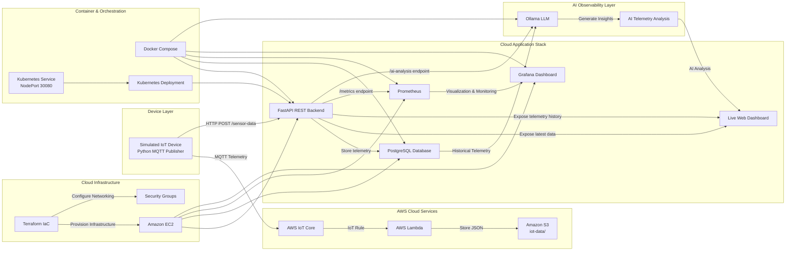
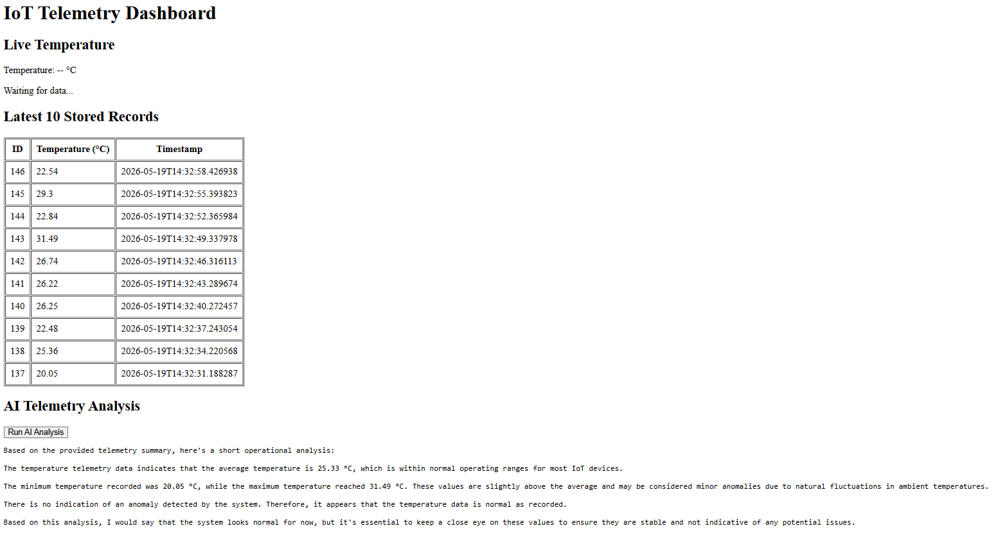
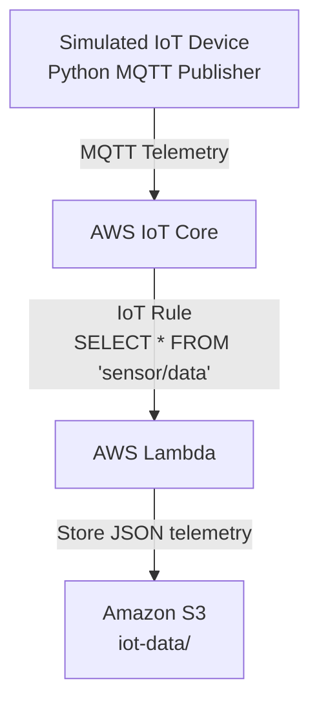

# Cloud-Native IoT Telemetry, Monitoring & AI Observability Platform

A cloud-native IoT telemetry, monitoring, observability, and AI-assisted analytics platform built using AWS IoT Core, FastAPI, PostgreSQL, Docker, Prometheus, Grafana, Terraform, and Ollama.

The platform simulates IoT sensor telemetry, processes data through MQTT and REST-based cloud services, stores telemetry persistently in PostgreSQL, provides real-time monitoring dashboards through Grafana and Prometheus, and leverages an AI-powered observability assistant to analyze historical telemetry and generate operational insights.

The complete stack is containerized using Docker Compose and deployed on a cloud-hosted Linux environment running on Amazon EC2.

---

## Project Overview

The system simulates telemetry data from an IoT device and publishes it through MQTT to AWS IoT Core. Telemetry data is processed through AWS cloud services and forwarded to a FastAPI backend through REST APIs, where it is exposed through monitoring endpoints and stored persistently in PostgreSQL.

The platform includes:

- Real-time telemetry ingestion using MQTT
- AWS IoT Core, AWS Lambda, and Amazon S3 integration workflows
- Cloud-hosted backend services on Amazon EC2
- Infrastructure provisioning using Terraform
- Persistent telemetry storage using PostgreSQL
- Observability and monitoring using Prometheus and Grafana
- AI-assisted telemetry analysis using Ollama LLM
- Containerized multi-service deployment using Docker Compose
- Kubernetes-based local deployment workflows
- CI workflow automation using GitHub Actions
---


## System Architecture




## AI Observability Assistant

The platform includes an AI-powered observability assistant built using Ollama and FastAPI.

The assistant analyzes historical telemetry data stored in PostgreSQL and generates operational summaries that help identify abnormal behavior, temperature trends, and potential system issues.

### Features

* Automated telemetry analysis
* Historical data summarization
* Basic anomaly detection
* Human-readable operational insights
* Fully self-hosted using open-source LLMs (Ollama)

### AI Analysis Workflow

```text
PostgreSQL Telemetry Data
            ↓
      FastAPI Backend
            ↓
        Ollama LLM
            ↓
 AI Operational Summary
            ↓
 Dashboard & API Output
```

### Example Telemetry Summary

```json
{
  "records_analyzed": 10,
  "average_temperature": 25.33,
  "minimum_temperature": 20.05,
  "maximum_temperature": 31.49,
  "anomaly_detected": false
}
```

### Example AI Output

> The system appears to be operating normally. Temperature values remain within expected operating ranges and no anomalies were detected in the analyzed telemetry data.

### API Endpoint

```http
GET /ai-analysis
```

Example Response:

```json
{
  "telemetry_summary": {
    "records_analyzed": 10,
    "average_temperature": 25.33,
    "minimum_temperature": 20.05,
    "maximum_temperature": 31.49,
    "anomaly_detected": false
  },
  "ai_analysis": "The system appears to be operating normally. Temperature values remain within expected operating ranges and no anomalies were detected."
}
```

## AI Analysis Dashboard



## AWS-Native Serverless Pipeline

The project also includes an AWS-native telemetry flow using AWS IoT Core, IoT Rules, Lambda, and Amazon S3.

### AWS Serverless Architecture



### Components

- **AWS IoT Core** receives MQTT telemetry from the simulated device
- **IoT Rule Engine** routes messages from the `sensor/data` topic
- **AWS Lambda** processes incoming telemetry events
- **Amazon S3** stores telemetry payloads as JSON files under `iot-data/`
- The MQTT publisher supports AWS-only mode using `ENABLE_LOCAL_API = False`

### Runtime Modes

The MQTT publisher can run in two modes:

```python
ENABLE_LOCAL_API = False
```

AWS-native mode:

```text
MQTT Publisher → AWS IoT Core → IoT Rule → Lambda → S3
```

```python
ENABLE_LOCAL_API = True
```

Hybrid local monitoring mode:

```text
MQTT Publisher → AWS IoT Core + Local FastAPI Dashboard
```

## Features

- Real-time sensor telemetry simulation
- MQTT publish/subscribe communication
- Secure AWS IoT Core connection using device certificates
- FastAPI-based REST API for telemetry ingestion
- JSON-based HTTP communication
- Live browser dashboard with automatic data updates
- Git-based project version control

---

## Technologies Used

### Cloud & Infrastructure
- AWS IoT Core
- AWS Lambda
- Amazon S3
- Amazon EC2
- FastAPI
- PostgreSQL
- Docker
- Docker Compose
- Kubernetes
- Terraform
- GitHub Actions
- Prometheus
- Grafana
- Ollama
- Python
- MQTT


### Backend & APIs
- Python
- FastAPI
- REST API
- MQTT
- JSON

### Database & Persistence
- PostgreSQL
- SQL

### Monitoring & Observability
- Prometheus
- Grafana

### Frontend & Visualization
- HTML
- JavaScript

### DevOps & Automation
- GitHub Actions CI
- YAML

### Development Workflow
- Git
- Linux / CLI workflow
- Cloud deployment on AWS EC2
- Dockerized multi-service deployment

---

## API Endpoints

### POST `/sensor-data`

Receives sensor telemetry data.

Example request:

```json
{
  "temperature": 27.5
}
```

---

### GET `/sensor-data`

Returns the latest telemetry value.

Example response:

```json
{
  "temperature": 27.5,
  "timestamp": "2026-05-13T14:30:22"
}
```

---

## Running the Project Locally

### 1. Install dependencies

```bash
pip install -r requirements.txt
```

---

### 2. Start FastAPI server

```bash
uvicorn api_server:app --reload
```

Open:

```text
http://127.0.0.1:8000/
```

---

### 3. Start MQTT publisher

In a second terminal:

```bash
python mqtt_publish.py
```

---

## Security Note

AWS certificates and private keys are not included in this repository. They are excluded using `.gitignore`.

---

## Docker Support

The FastAPI backend can also be run inside a Docker container.

### Build Docker image

```bash
docker build -t iot-fastapi-backend .
```

### Run Docker container

```bash
docker run -p 8000:8000 iot-fastapi-backend
```

Open:

```text
http://127.0.0.1:8000/
```

The dashboard and API will run from inside the containerized environment.


---

## Kubernetes Deployment

The FastAPI backend can also be deployed locally using Kubernetes through Docker Desktop.

### Apply Kubernetes configuration

```bash
kubectl apply -f k8s/
```

### Check running pods

```bash
kubectl get pods
```

### Check service

```bash
kubectl get services
```

### Access the application

```text
http://localhost:30080/
```

### Stop Kubernetes deployment

```bash
kubectl delete -f k8s/
```

This deployment uses a Kubernetes `Deployment` to run the FastAPI container and a `NodePort` service to expose it locally.


---

## PostgreSQL Telemetry Persistence

The platform now stores telemetry data persistently using PostgreSQL.

### Database Flow

```text
MQTT Publisher
    ↓
FastAPI Backend
    ↓
PostgreSQL Database
    ↓
REST API History Endpoint
```

### Features

- Persistent telemetry storage
- Historical sensor records
- SQL-based querying
- REST API access to stored history
- Live dashboard + historical database integration

### PostgreSQL Table Schema

```sql
CREATE TABLE sensor_data (
    id SERIAL PRIMARY KEY,
    temperature DOUBLE PRECISION,
    timestamp TIMESTAMP DEFAULT CURRENT_TIMESTAMP
);
```

### REST API Endpoints

Latest telemetry:

```text
GET /sensor-data
```

Historical telemetry:

```text
GET /sensor-history
```

Prometheus metrics:

```text
GET /metrics
```

### PostgreSQL Dashboard & SQL Queries

#### Dashboard with Historical Data


---

## Cloud Deployment on AWS EC2

The complete observability and telemetry stack is deployed on an Ubuntu-based Amazon EC2 instance using Docker Compose.

### Cloud Deployment Features

- Remote cloud-hosted FastAPI backend
- Publicly accessible telemetry dashboard
- PostgreSQL database persistence on EC2
- Grafana and Prometheus observability stack
- Dockerized multi-container deployment
- Linux-based cloud server administration
- AWS security group configuration and networking

### EC2 Deployment Flow

```text
Laptop MQTT Publisher
        ↓
AWS IoT Core
        ↓
FastAPI Backend on EC2
        ↓
PostgreSQL Database
        ↓
Grafana & Prometheus
```


---

## Monitoring Stack

The platform includes a containerized monitoring and observability stack using Prometheus and Grafana.

### Monitoring Architecture

```text
IoT Device Simulation
        ↓
FastAPI Backend
        ↓
Prometheus Metrics Endpoint (/metrics)
        ↓
Prometheus Scraping
        ↓
Grafana Dashboard Visualization
```

### Monitoring Components

- Prometheus used for telemetry metric collection and scraping
- Grafana used for real-time dashboard visualization
- Custom temperature metrics exported from FastAPI using Prometheus client library
- Docker Compose used for multi-service orchestration

### Running the Monitoring Stack

```bash
docker compose up --build
```

### Access Services

FastAPI Dashboard:

```text
http://127.0.0.1:8000/
```

Prometheus:

```text
http://127.0.0.1:9090/
```

Grafana:

```text
http://127.0.0.1:3000/
```

Default Grafana credentials:

```text
Username: admin
Password: admin
```


---

## Project Screenshots

### Grafana Monitoring Dashboard


---

### FastAPI Live Telemetry Dashboard


---

### Prometheus Metrics Monitoring


---

### Docker Containerized Services


---

### Kubernetes Deployment


## Current Status

The platform currently includes:

- Real-time MQTT telemetry publishing using AWS IoT Core
- AWS IoT Rule Engine integration
- AWS Lambda serverless telemetry processing
- Amazon S3 telemetry storage pipeline
- FastAPI-based REST API backend
- Live browser telemetry dashboard
- PostgreSQL-based telemetry persistence and historical storage
- REST API history endpoints for telemetry retrieval
- Prometheus metrics scraping and observability integration
- Grafana dashboard visualization
- AI-assisted telemetry analysis using Ollama LLM
- AI-powered operational summaries generated from historical telemetry data
- AI analysis dashboard integration through FastAPI endpoints
- Dockerized multi-service deployment workflows
- Docker Compose orchestration
- Kubernetes-based local deployment workflows
- GitHub Actions CI workflow automation
- Amazon EC2 cloud deployment on Ubuntu Linux
- Linux-based cloud server administration and networking workflows
- Git-based version control and feature branch development workflow
- Infrastructure as Code using Terraform for AWS EC2 provisioning and cloud networking automation

## Planned Future Extensions

- AI-driven anomaly detection and alert classification
- AI-generated operational recommendations and incident summaries
- Reverse proxy and HTTPS deployment workflows
- Advanced Kubernetes orchestration and scaling
- Automated cloud deployment pipelines
- Extended observability and alerting workflows
- Secure cloud networking and infrastructure hardening
- GitOps workflows using Helm and ArgoCD
- Cloud-native deployment on managed Kubernetes platforms (EKS)
